# Gabriel "Snywy" Furtado

**23y/o • Computer Science @ CIn-UFPE 🇧🇷**

Currently on an academic exchange. I'm currently focused on my university studies.
Because of my current course load, I'm not active on email right now.

  
  

  
  

---

### 🚀 What I'm working on

* **Academic:** Deepening my knowledge in Java and MySQL for university projects.
* **Game Dev:** Experimenting with Godot.
* **Creative/Hardware:** Learning 3D modeling in Blender and messing around with Raspberry Pi.

### 🛠 My Arsenal

**Languages & Frameworks**

**Tools & Creative Software**

---

### 🎵 What's on loop?

  
  

 

**Catch y'all on the flip side! 👋**

